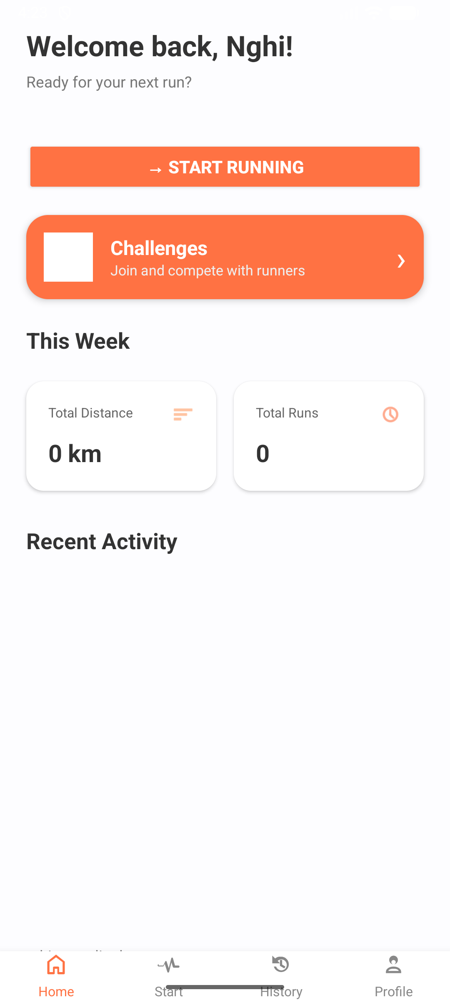
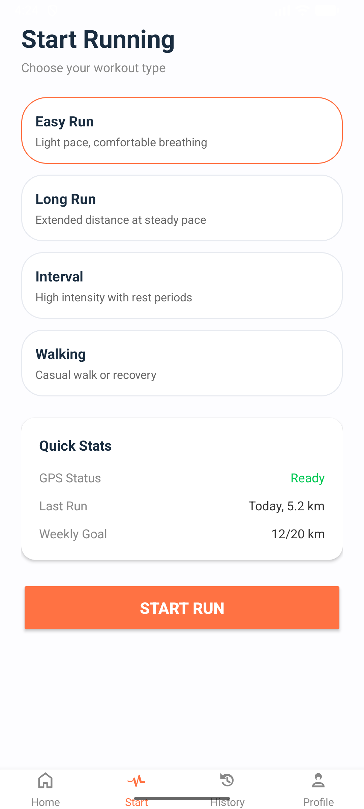
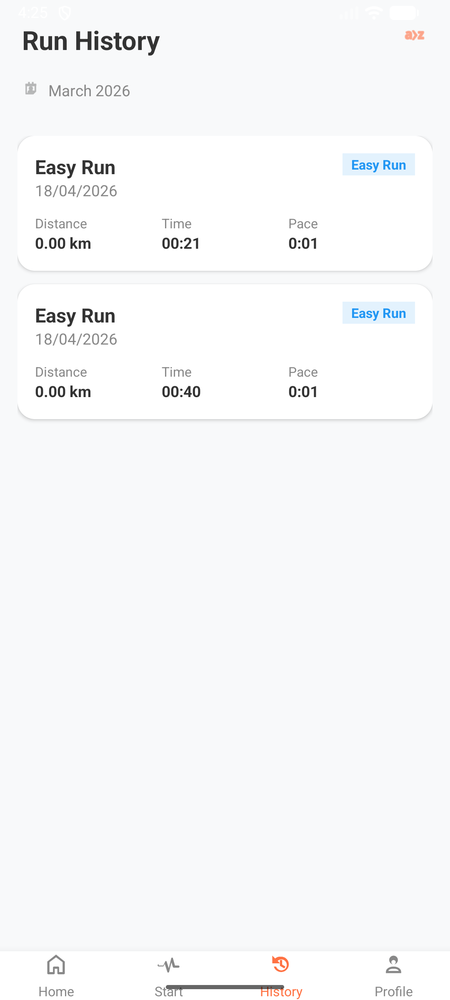
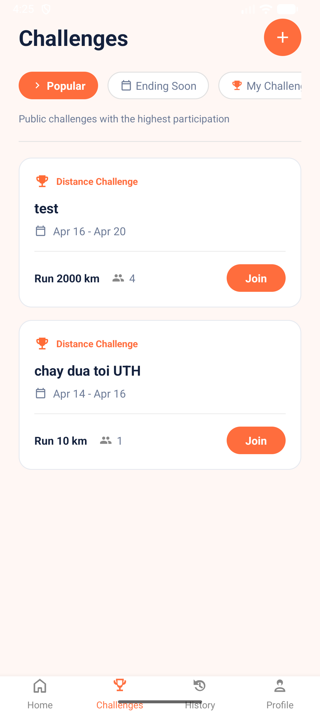

# Runna

Runna là ứng dụng theo dõi sức khoẻ trên nền tảng Android, được thiết kế cho việc quản lý các hoạt động chạy bộ, ghi nhận kết quả các buổi tập chạy và hỗ trợ theo dõi tiến độ luyện tập mỗi ngày. Ứng dụng mang đến một giao diện dễ nhìn, giúp người dùng có thể theo dõi quãng đường một cách dễ dàng, thời gian, pace, lượng calo tiêu thụ, xem lại lịch sử các buổi chạy và tham gia các thử thách chạy bộ, tất cả được tích hợp trong Runna

## Tính năng bao gồm

1. **Định vị & Theo dõi GPS trực tiếp**: Ghi nhận và hiển thị chính xác lộ trình của người chạy theo thời gian thực trên bản đồ tương tác thông qua hệ thống OpenStreetMap.
2. **Đa dạng chế độ**: Hỗ trợ nhiều mục tiêu khác nhau như Chạy nhịp nhàng, Chạy đường dài, Chạy Interval, và Đi bộ.
3. **Thống kê**: Ứng dụng tự động đo lường các chỉ số quan trọng gồm có quãng đường, thời gian chạy, pace trung bình và lượng calo đốt cháy. Hiển thị thông số tổng kết đầy đủ sau mỗi lần chạy.
4. **Đồng bộ dữ liệu đám mây an toàn**: Mọi thông tin người dùng, lịch sử cá nhân đến dữ liệu các thử thách đều được tự động lưu trữ và đồng bộ hóa đám mây với Firebase Firestore.
5. **Lịch sử hoạt động**: Tính năng lưu trữ tự động toàn bộ lịch sử các bài tập đã hoàn thành, cho phép xem thống kê tổng quan trực tiếp trên màn hình Profile.
6. **Hệ thống thử thách/sự kiện**: Khám phá các thử thách chạy bộ công cộng, hoặc tiến hành tạo thử thách mới, tham gia thử thách nhanh chóng. App sẽ cập nhật tiến độ tự động ngay khi quá trình chạy kết thúc.
7. **Tài khoản cá nhân**: Hỗ trợ đăng ký và đăng nhập bảo mật qua Email/Mật khẩu. Dễ dàng đổi mật khẩu và quản lý hồ sơ người dùng tiện lợi.

## Giao diện ứng dụng

  
  
  
  

## Công nghệ phát triển 

*   **[Kotlin]**
*   **Android XML & UI**
*   **[OpenStreetMap (OSMDroid)]**
*   **[Figma]**
*   **[Firebase Authentication]**
*   **[Cloud Firestore]**

## Các màn hình chính

*   Đăng nhập / Đăng ký / Hoàn tất hồ sơ 
*   Trang chủ 
*   Bắt đầu chạy / Theo dõi buổi chạy / Tổng kết buổi chạy
*   Lịch sử theo dõi
*   Thử thách / Chi tiết thử thách / Tạo thử thách mới
*   Cài đặt người dùng

## Hướng dẫn chạy dự án

1.  Mở dự án này bằng **Android Studio**.
2.  Sau khi clone code về, bảo đảm bạn đã tải xuống và lấy tệp `app/google-services.json` đặt vào bên trong thư mục `app` để kết nối vào Firebase.
3.  Vào console dự án Firebase và kích hoạt tính năng **Firebase Authentication** cùng dự án cơ sở dữ liệu **Cloud Firestore**.
4.  Chạm vào biểu tượng *Sync Project with Gradle Files* và đợi hệ thống tải toàn bộ các thư viện cần thiết.
5.  Thực hiện lệnh Build và chạy ứng dụng trực tiếp trên thiết bị giả lập hoặc thiết bị thật.

